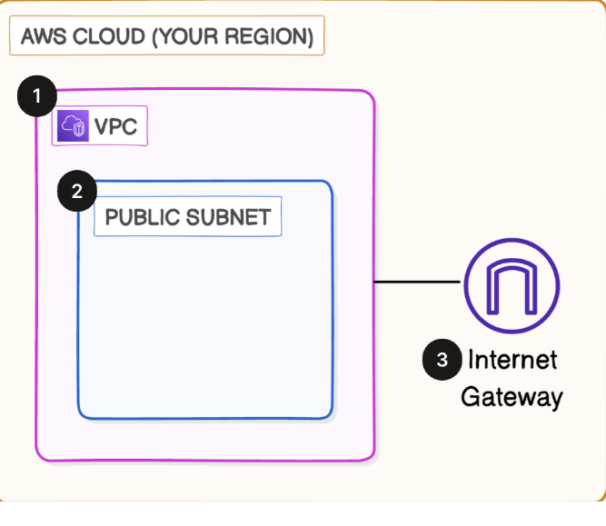

# 🏗️ Project 1: Build a Virtual Private Cloud (VPC)

Created a custom AWS VPC with a public subnet and Internet Gateway to enable secure internet access.

---

## 📌 Objective
Gain hands-on experience with foundational AWS networking by building a VPC, subnet, and Internet Gateway.

---

## 🛠️ AWS Services & Concepts
- Amazon VPC
- IPv4 CIDR Blocks
- Subnets
- Internet Gateways

---

## 🏗️ Architecture Diagram

---

## 🚀 Steps Performed
- Created VPC (`10.10.0.0/16`)
- Added public subnet (`10.10.0.0/24`)
- Created Internet Gateway and attached it to VPC
- Verified external connectivity for public resources

---

## 🎯 Outcome
- Custom VPC with internet-enabled public subnet
- Gained practical experience in CIDR planning and subnet association

---

## ✅ Key Learnings
- Understood purpose of VPCs, subnets, and IGWs
- Practiced IP addressing and region/AZ selection
- Built the foundational layer of AWS networking

---

📄 **Detailed Documentation:** [View Full Project Document](./02_Project_Document)  

🔗 Next Project: [VPC Traffic Flow and Security](./02_VPC_Traffic_flow_and_security)

---
*This is the 1st project of Networking Series*
