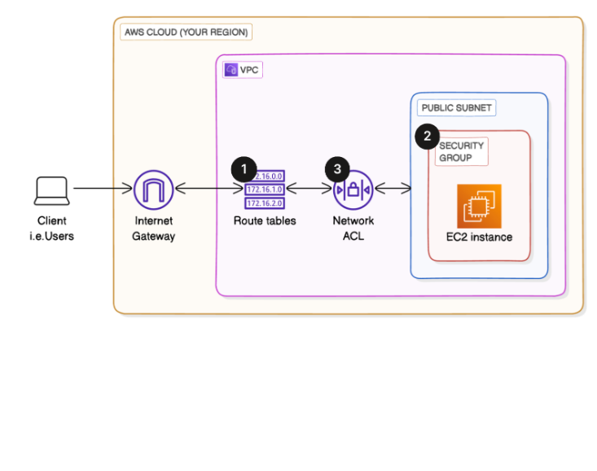

# 🏗️ Project 2: VPC Traffic Flow and Security

Enhanced the custom AWS VPC (from Project 1) by adding Route Tables, Security Groups, and Network ACLs to manage and secure traffic flow.

---

## 📌 Objective
Gain hands-on experience with controlling traffic flow and securing resources in a VPC using Route Tables, Security Groups, and NACLs.

---

## 🛠️ AWS Services & Concepts
- Amazon VPC  
- Route Tables  
- Security Groups  
- Network ACLs (NACLs)  
- Subnets & CIDR Blocks  

---

## 🏗️ Architecture Diagram

---

## 🚀 Steps Performed
- Created and associated a **Route Table** with the public subnet  
- Configured **Security Group rules** for inbound/outbound traffic  
- Implemented **Network ACLs** for subnet-level security control  
- Tested connectivity to verify correct traffic flow  

---

## 🎯 Outcome
- VPC with controlled traffic flow using Route Tables  
- Security Groups and NACLs implemented for layered security  
- Better understanding of subnet-level vs. instance-level protection  

---

## ✅ Key Learnings
- Difference between Security Groups (stateful) and NACLs (stateless)  
- Importance of Route Tables for directing traffic within a VPC  
- How layered security (SG + NACL) strengthens AWS networking setup  

---

📄 **Detailed Documentation:** [View Full Project Document](./02_Project_Document.pdf)  

🔗 Next Project: [Creating a Private Subnet](../03_Create_Private_Subnet)

---

✅ *This is Project 2 of a 9-part AWS Networking Series.*
