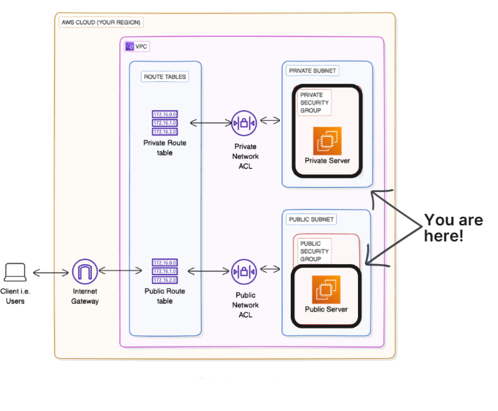

# 🏗️ Project 3: Building a Private Subnet

Designed and configured a Private Subnet within a custom VPC to create a secure, isolated environment without direct internet access.

---

## 📌 Objective
Gain hands-on experience with building a private network environment in AWS using a Private Subnet, Route Table, and custom NACLs.

---

## 🛠️ AWS Services & Concepts
- Amazon VPC  
- Private Subnets  
- Route Tables  
- Network ACLs (NACLs)  
- Traffic Isolation  

---

## 🏗️ Architecture Diagram

---

## 🚀 Steps Performed
- Created a **Private Subnet** within the existing VPC  
- Configured and associated a **dedicated Private Route Table**  
- Applied a **custom Network ACL** for subnet-level security  
- Validated isolation by testing traffic behavior (no internet access)  

---

## 🎯 Outcome
- Secure Private Subnet successfully created  
- Subnet traffic isolated from the internet  
- Reinforced understanding of private network design in AWS  

---

## ✅ Key Learnings
- How Private Subnets provide controlled, secure environments for resources  
- Role of Route Tables in managing private vs. public traffic flows  
- Difference between NACLs and Security Groups for subnet protection  

---

📄 **Detailed Documentation:** [View Full Project Document](./)  

🔗 Next Project: [Launching VPC Resources](LINK_TO_NEXT_PROJECT)

✅ *This is Project 3 of a 9-part AWS Networking Series.*
