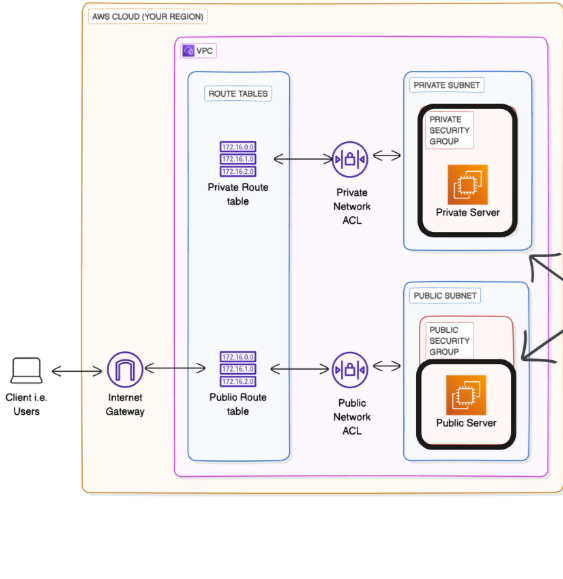

# 🏗️ Project 4: Launching VPC Resources

Built on previous projects to launch both public and private resources within a VPC, enabling hands-on experience with real-world AWS architecture.

---

## 📌 Objective
Gain practical experience with launching EC2 instances in public and private subnets, setting up key pairs, and understanding VPC resource connectivity.

---

## 🛠️ AWS Services & Concepts
- Amazon VPC  
- Public & Private Subnets  
- EC2 Instances  
- Key Pairs & SSH  
- NAT Gateways  
- VPC Resource Map  
- Tenancy  

---

## 🏗️ Architecture Diagram

---

## 🚀 Steps Performed
- Launched an **EC2 instance in a public subnet**  
- Launched an **EC2 instance in a private subnet**  
- Set up the **entire VPC configuration** using the AWS console wizard  
- Configured **Key Pairs** for secure SSH access  
- Explored **VPC Resource Map** for connected components  
- Set up a **NAT Gateway** for private subnet internet access  

---

## 🎯 Outcome
- Public and Private EC2 instances successfully launched  
- Private subnet can access the internet securely via NAT Gateway  
- Reinforced understanding of launching VPC resources in AWS  

---

## ✅ Key Learnings
- How to launch and manage EC2 instances in public and private subnets  
- Importance of Key Pairs and SSH for secure access  
- NAT Gateway usage for internet connectivity in private networks  
- Visualizing VPC resources using the VPC Resource Map  

---

📄 **Detailed Documentation:** [View Full Project Document](./02_Project_Document.pdf)  

🔗 Next Project: [Testing VPC Connectivity](../05_Testing_VPC_Connectivity)  

---

✅ *This is Project 4 of a 9-part AWS Networking Series.*
